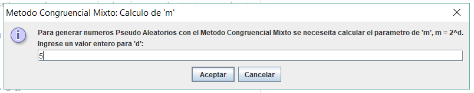
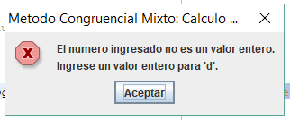
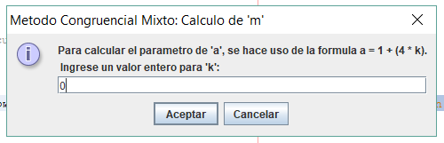
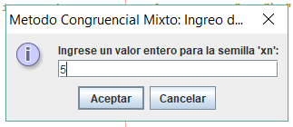

# MetodosCongruenciales
Metodos Congruenciales para generar numeros pseudo aleatorios. Metodo Congruencial Mixto y Multiplicativo.

-Método Congruencial Mixto
Es un algoritmo utilizado para la generación de números aleatorios, mediante la siguiente formula:
Xn+1 = ((a)Xn + c) mod m
Ejecucion del Programa
1.  Para generar numeros Pseudo Aleatorios con el Metodo Congruencial Mixto se neceseita calcular el parametro de 'm', m = 2^d.
Se ingresa el valor de 'd' que tiene que ser entero y mayor que 0:

En caso de que el usu no ingrese un valor acorde para cumplir las condiciones se le presentara un mensaje de error indicandole las condiciones necesarias para que se acepte el valor correcto y regresara a la primera pantalla para su ingreso(4*

2. Para calcular el parámetro de ‘a’, se hace uso de la formula a = 1 + (4 * k).
Se ingresa el valor de ‘k’ que tiene que ser entero y mayor que 0:

Para todos los ingresos de valores en caso de no cumpli las condiciones se presentara mensajes  como el mencionado anteriormente
3.  Se ingresa el valor  de xn que tiene que ser entero y mayor que 0:

4.  Se generan los resultados

